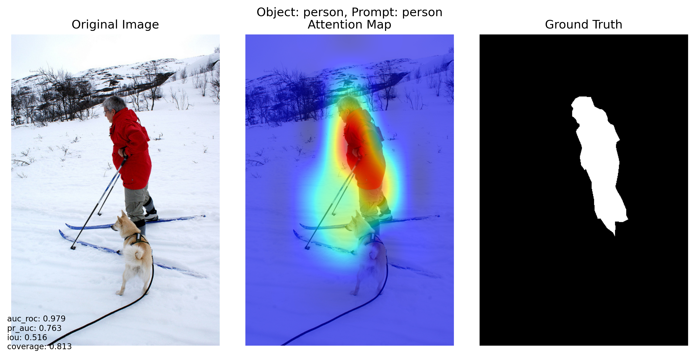
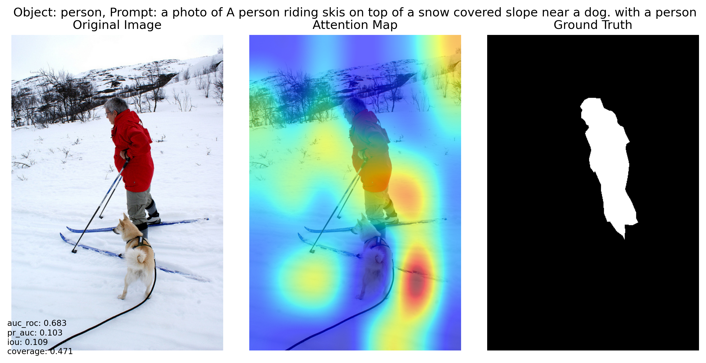
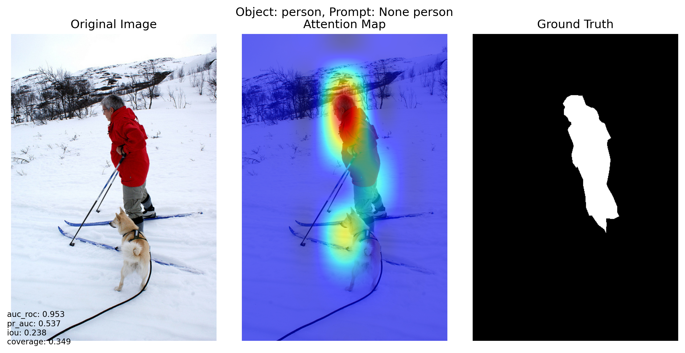

# Prompt2CLIP: Analyzing CLIP's Visual Attention Through Prompt Engineering

Prompt2CLIP is a research project that explores how different text prompts affect CLIP's visual attention mechanisms. This project investigates the relationship between textual descriptions and visual attention patterns, focusing on the impact of different prompting strategies on object localization.

## Features

- Multiple prompting strategies for visual attention analysis
- Integration with COCO dataset for diverse image experiments
- GradCAM visualization of CLIP's attention patterns
- Quantitative evaluation metrics for attention quality
- Scene context analysis and prompt refinement
- Support for custom prompt templates

## Installation

1. Create a new conda environment:
```bash
conda create -n prompt2clip python=3.9
conda activate prompt2clip
```

2. Install PyTorch with CUDA support (for RTX 2080 Ti):
```bash
# For CUDA 12.1
pip install torch torchvision --index-url https://download.pytorch.org/whl/cu121
```

3. Install other dependencies:
```bash
# Install numpy before other packages
pip install numpy==1.24.3

# Image processing
pip install Pillow
pip install scikit-image
pip install matplotlib

# Machine learning
pip install scikit-learn

# CLIP and utilities
pip install ftfy regex tqdm
pip install git+https://github.com/openai/CLIP.git

# COCO API
pip install pycocotools
```

## Project Structure
```
Prompt2CLIP/
├── config/
│   ├── __init__.py
│   └── config.py           # Configuration settings
├── data/
│   ├── __init__.py
│   ├── coco_loader.py      # COCO dataset handler
│   └── scene_analyzer.py   # Scene context extractor
├── models/
│   ├── __init__.py
│   ├── clip_wrapper.py     # CLIP model wrapper
│   └── gradcam.py         # GradCAM implementation
├── evaluation/
│   ├── __init__.py
│   ├── metrics.py         # Evaluation metrics
│   └── visualizer.py      # Visualization tools
├── utils/
│   ├── __init__.py
│   └── helpers.py         # Utility functions
├── results/               # Output directory
├── main.py               # Main experiment script
└── requirements.txt      # Dependencies list
```

## Dataset Setup

1. Download COCO 2017 validation set:
```bash
# Create directories
mkdir -p coco/annotations coco/val2017

# Download annotations
wget http://images.cocodataset.org/annotations/annotations_trainval2017.zip
unzip annotations_trainval2017.zip -d coco/

# Download validation images
wget http://images.cocodataset.org/zips/val2017.zip
unzip val2017.zip -d coco/
```

2. Update data paths in `config/config.py` if needed.

## Running Experiments

1. Basic usage:
```bash
python main.py
```

2. The program will:
- Select diverse images from COCO dataset
- Generate attention maps using different prompt types
- Save visualizations to the results directory
- Compute evaluation metrics for each prompt strategy

## Prompt Types

The project implements three types of prompts:

1. **Baseline**
   - Simple object names
   - Example: "cat"

2. **Context-Enhanced**
   - Object names with scene context
   - Example: "a cat in an indoor setting"

3. **Caption-Based**
   - Full image captions with object emphasis
   - Example: "a photo of a living room with a cat resting on a couch"

## Evaluation Metrics

- **AUC-ROC**: Area under ROC curve
- **PR-AUC**: Area under Precision-Recall curve
- **IoU**: Intersection over Union with ground truth
- **Coverage**: Object area coverage ratio

## Visualization

The project generates several types of visualizations:
- Original images with bounding boxes
- Attention heatmaps
- Ground truth masks
- Combined visualizations with metrics

Results are saved in the `results/` directory with detailed metrics.

## Example

### Baseline


### Caption


### Context


## Customization

1. Modifying prompt templates:
Edit `generate_prompt()` in `main.py` to add new prompt strategies.

2. Adding new metrics:
Extend `EvaluationMetrics` class in `evaluation/metrics.py`.

3. Adjusting visualization:
Modify `Visualizer` class in `evaluation/visualizer.py`.

## Requirements

- Python 3.9+
- PyTorch 2.0+
- CUDA compatible GPU (tested on RTX 2080 Ti)
- 11GB+ GPU memory
- 8GB+ RAM

## Known Issues

1. CUDA Compatibility
   - If encountering CUDA errors, ensure PyTorch version matches your CUDA version
   - For RTX 2080 Ti, CUDA 12.1 is recommended

2. Memory Management
   - Reduce `NUM_IMAGES` in config if encountering OOM errors
   - Use `torch.cuda.empty_cache()` if needed

## Contributing

Contributions are welcome! Please feel free to submit a Pull Request.


## License

[Choose an appropriate license]

## Acknowledgments

- OpenAI CLIP Team
- COCO Dataset Team
- PyTorch Community