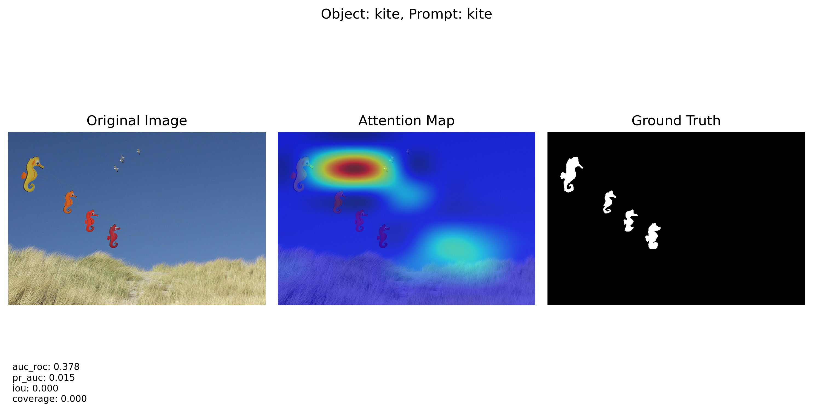
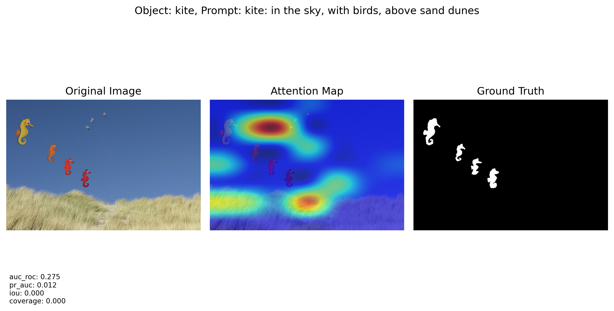
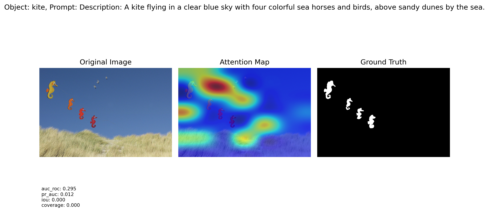
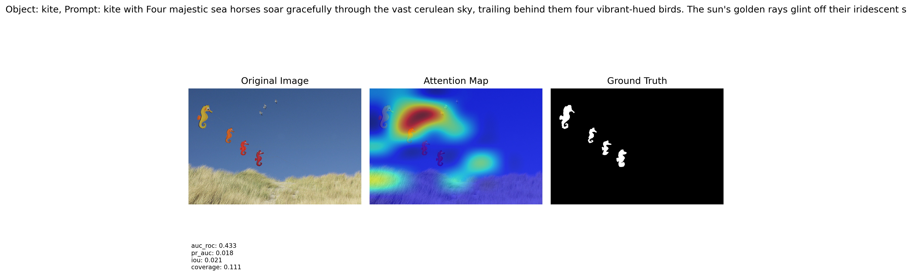

# Prompt2CLIP: Analyzing CLIP's Visual Attention Through Prompt Engineering

Prompt2CLIP is a research project that explores how different text prompts affect CLIP's visual attention mechanisms. This project investigates the relationship between textual descriptions and visual attention patterns, focusing on the impact of different prompting strategies on object localization and understanding how language can guide visual attention in multi-modal AI systems.

## Features

- Multi-stage prompt generation and refinement pipeline
- Integration with COCO dataset for diverse image experiments
- GradCAM visualization of CLIP's attention patterns
- Quantitative evaluation metrics for attention quality
- Scene context analysis and prompt refinement
- GPT-enhanced prompt generation
- Support for hallucination and complex context analysis

## Installation

1. Create a new conda environment:
```bash
conda create -n prompt2clip python=3.9
conda activate prompt2clip
```

2. Install PyTorch with CUDA support (for RTX 2080 Ti):
```bash
# For CUDA 12.1
pip install torch torchvision --index-url https://download.pytorch.org/whl/cu121
```

3. Install other dependencies:
```bash
# Install numpy before other packages
pip install numpy==1.24.3

# Image processing
pip install Pillow
pip install scikit-image
pip install matplotlib

# Machine learning
pip install scikit-learn

# CLIP and utilities
pip install ftfy regex tqdm
pip install git+https://github.com/openai/CLIP.git

# COCO API
pip install pycocotools

# For GPT integration
pip install python-dotenv
pip install openai
```

## Project Structure
```
Prompt2CLIP/
├── config/               # Configuration settings
├── data/                # Dataset handlers
├── models/              # Model implementations
├── evaluation/          # Metrics and visualization
├── tools/              # Prompt generation tools
├── utils/              # Utility functions
├── results/            # Output directory
├── src/                # Example visualizations
├── modified_prompt.py  # Prompt refinement script
├── main.py            # Main experiment script
└── requirements.txt   # Dependencies list
```

## Configuration

### OpenAI API Key Setup
Before running the prompt refinement process, you need to set up your OpenAI API key:

1. Create a `.env` file in the project root:
```bash
touch .env
```

2. Add your OpenAI API key to the `.env` file:
```env
OPENAI_API_KEY=your_api_key_here
```

## Dataset Setup

1. Download COCO 2017 validation set:
```bash
# Create directories
mkdir -p coco/annotations coco/val2017

# Download annotations
wget http://images.cocodataset.org/annotations/annotations_trainval2017.zip
unzip annotations_trainval2017.zip -d coco/

# Download validation images
wget http://images.cocodataset.org/zips/val2017.zip
unzip val2017.zip -d coco/
```

## Running Experiments

The experiment pipeline consists of three stages:

1. Generate Initial Prompts:
```bash
python tools/prompt_generator.py
```
Generates `prompts_template.json` containing base prompts.

2. Refine Prompts:
```bash
python modified_prompt.py
```
Creates enhanced prompts in `Updated_PROMPTS_TEMPLATE.JSON`.

3. Run Main Experiment:
```bash
python main.py
```
Processes images and generates results.

## Prompt Types and Examples

Using a real case from our dataset (Image ID: 227765 - Vegetable Soup Scene):

### Original Image Context
```json
{
    "captions": [
        "The meal is being prepared in the big pot.",
        "Overview of a pot of vegetable soup with wooden spoon on a stainless steel stove top.",
        "A wooden spoon in a soup pot on the stove.",
        "A large pot of vegetable soup with a large wooden spoon.",
        "a pot filled with a soup with a lot of carrots"
    ],
    "objects": ["carrot", "spoon"]
}
```

### Generated Prompts

1. **Baseline Prompts**
   ```json
   "baseline": {
       "carrot": "carrot",
       "spoon": "spoon"
   }
   ```

2. **Context Prompts**
   ```json
   "context": {
       "carrot": "carrot: {in pot, with vegetable soup, on stove top}",
       "spoon": "spoon: in the big pot, on a stainless steel stove top, in a soup pot"
   }
   ```

3. **Complex Context Prompts**
   ```json
   "complex_context": {
       "carrot": "Refined Description: A large pot of vegetable soup simmering on a stainless steel stove top, filled with plentiful carrots and stirred by a wooden spoon.",
       "spoon": "The spoon is inside a large pot of vegetable soup on a stainless steel stove top, with carrots visible in the soup."
   }
   ```

4. **Hallucination Prompts**
   ```json
   "hallucination": {
       "carrot": "carrot with In a cozy, rustic kitchen, a large, bubbling cauldron sits atop a crackling fire...",
       "spoon": "spoon with As the sun began to set, the bustling kitchen was filled with the aroma..."
   }
   ```

## Visual Results

Here's how different prompt types affect attention visualization for a kite object:

### Baseline Attention

*Simple object name prompt: "kite"*

### Context-Enhanced Attention

*Context-aware prompt: Scene-specific object description*

### Complex Context Attention

*Detailed contextual prompt: Rich scene description*

### Hallucination Attention

*Imaginative prompt: Creative and supernatural elements*

Each visualization shows:
- Left: Original image
- Middle: Attention heatmap overlay
- Right: Ground truth mask
- Bottom: Evaluation metrics

## Evaluation Metrics

- **AUC-ROC**: Area under ROC curve for attention accuracy
- **PR-AUC**: Area under Precision-Recall curve
- **IoU**: Intersection over Union with ground truth mask
- **Coverage**: Object area coverage ratio

## Customization

1. Prompt Generation (`tools/prompt_generator.py`):
   - Adjust object selection criteria
   - Modify prompt templates
   - Change number of objects per image

2. Prompt Refinement (`modified_prompt.py`):
   - Customize GPT prompt strategies
   - Add new prompt types
   - Modify context extraction

3. Visualization (`evaluation/visualizer.py`):
   - Adjust heatmap overlay
   - Modify metric display
   - Change output format

## Requirements

- Python 3.9+
- PyTorch 2.0+
- CUDA compatible GPU (tested on RTX 2080 Ti)
- 11GB+ GPU memory
- 8GB+ RAM
- OpenAI API key for GPT integration

## Known Issues

1. CUDA Compatibility
   - If encountering CUDA errors, ensure PyTorch version matches your CUDA version
   - For RTX 2080 Ti, CUDA 12.1 is recommended

2. Memory Management
   - Reduce `NUM_IMAGES` in config if encountering OOM errors
   - Use `torch.cuda.empty_cache()` if needed

3. GPT API
   - Ensure API key is properly set in .env
   - Monitor API usage limits
   - Handle rate limiting in prompt generation

## Contributing

Contributions are welcome! Please feel free to submit a Pull Request.


## Acknowledgments

- OpenAI CLIP Team
- COCO Dataset Team
- PyTorch Community
- OpenAI GPT Team